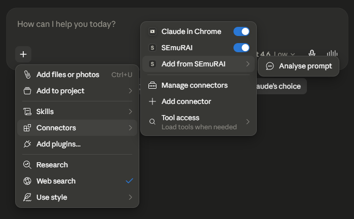
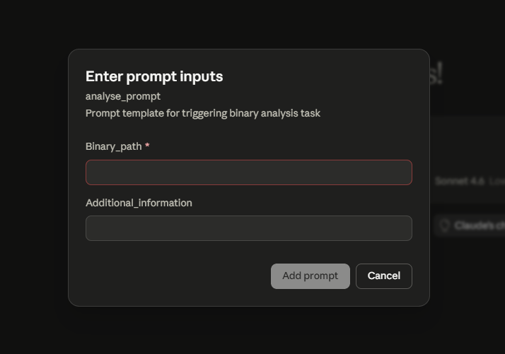

# SEmuRAI - Software Emulation and Reversing AI Framework

[](https://opensource.org/licenses/MIT) [](https://devnerdgr.com/assets/SEmuRAI%20Report.pdf)

*MCP server enabling LLMs to perform **dynamic binary analysis** for software reverse engineering purposes.* 

---

## About SEmuRAI

SEmuRAI is a Model Context Protocol (MCP) server that gives LLMs the ability to "run" (emulate) and interact with binaries during runtime through a debugger-like interface. The emulation capability is provided by [Qiling](https://github.com/qilingframework/qiling).

SEmuRAI is intended to be used alongside a static analysis toolkit (in particular [GhidraMCP](https://github.com/lauriewired/ghidramcp)). Static analysis serves to provide context to the LLM, while the dynamic analysis capabilities then allow for confirmation of hypotheses or behavioral analysis of difficult/obfuscated code paths.

### Key features

- Provision of dynamic analysis capabilities
    - Register and memory read/write during runtime
    - Breakpoints
    - Capturing of program's output (e.g. `stdout`) 
- Binary emulation in a sandboxed and isolated environment
- High level emulation sessions that abstract away Qiling's emulation API, preventing the need for LLMs to directly manage lower level internal states
- Designed around Ghidra-based workflows

## Installation

> [!TIP]
> Following this procedure is highly recommended! This is quickest way to get everything up and running and to avoid package conflicts.

### Setting up the MCP server

#### Prerequisites
- [`uv`](https://docs.astral.sh/uv/) Python package and project manager
- `git` CLI

#### Steps

1. In your chosen installation directory, run `git clone --recurse-submodules https://github.com/DevNerdGR/SEmuRAI-mcp.git` to install the project and the [required submodule (Qiling root FS)](https://github.com/qilingframework/rootfs)
2. `cd` into the project directory and run `uv sync` to install required packages
3. Add the MCP server to your MCP client. 
    <details>
    <summary>Example for Claude Desktop</summary>
    
    - Add the following block inside `"mcpServers"` in `claude_desktop_config.json` (hint: you can locate this file under `File`>`Settings`>`Developer`>`Edit Config`)
    ```json
    "SEmuRAI": {
        "command": "uv",
        "args": [
            "run",
            "--project",
            "/absolute/path/to/SEmuRAI/installation/directory",
            "/absolute/path/to/SEmuRAI/installation/directory/SemuraiMCPServer.py"
        ]
    }
    ```
    </details>

### Required dependencies
For SEmuRAI to function effectively, the following should also be installed:
- Ghidra (https://github.com/nationalsecurityagency/ghidra)
- GhidraMCP (https://github.com/lauriewired/ghidramcp)
- Ghidra Bridge (https://github.com/justfoxing/ghidra_bridge)

Note: ensure that the binary of interest is loaded in Ghidra and that the Ghidra Bridge server is running whenever you are using SEmuRAI.

## Usage
SEmuRAI provides a system prompt template for initialising analysis workflows. The prompt assigns a role to the agent, defines tool usage, outlines security guardrails and specifies expected agent behaviour. It also allows you to enter the path to the target binary (required to set up emulation) and any additional instructions or context specific to the task. It is recommended that you initiate an analysis session by using this prompt.

<details>
<summary>Example from Claude Desktop</summary>

##### Prompt selection

##### Prompt inputs


</details>

From here, you can ask the agent to trace execution, inspect memory at specific addresses or explain decompiled code paths.

## Limitations

While Qiling supports emulation of binaries on wide array of platforms, SEmuRAI currently supports only the following:
- x86_64 Linux
- ARM Linux
- ARM64 Linux
- x86_64 Windows
- x86_64 MacOS

## Presentations

SEmuRAI has been presented at the following events:
- Aug 2026: [Black Hat USA — Arsenal](https://blackhat.com/us-26/arsenal/schedule/index.html#semurai-software-emulation-and-reversing-ai-agent-53036)
- Mar 2026: [Singapore Science and Engineering Fair (SSEF) 2026](https://www.science.edu.sg/whats-on/for-schools/competitions/singapore-science-and-engineering-fair)
- Feb 2026: [NUS High School of Math and Science](https://www.nushigh.edu.sg/) Research Congress 2026

## Contact

For questions, feedback or collaboration, feel free to reach out at [gunrui@devnerdgr.com](mailto:gunrui@devnerdgr.com).